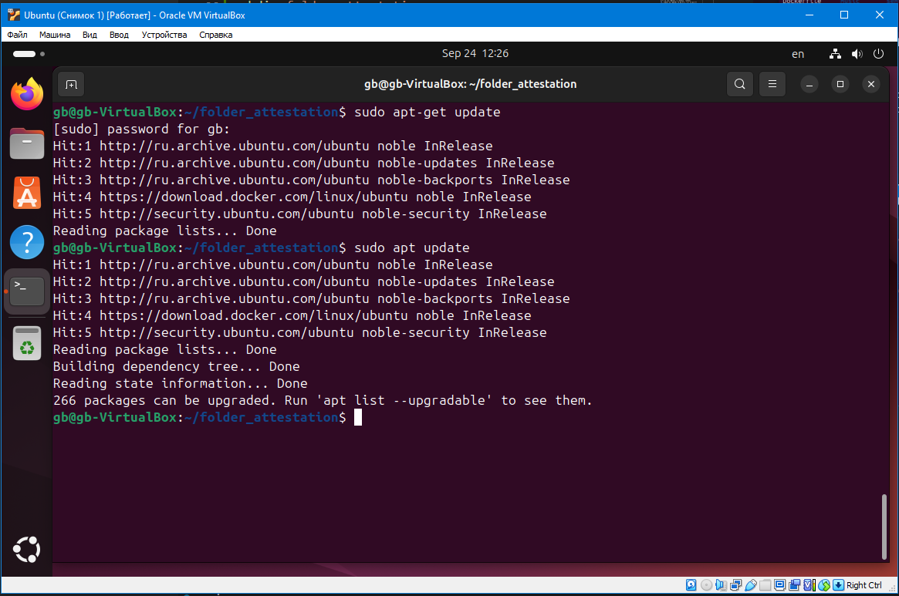
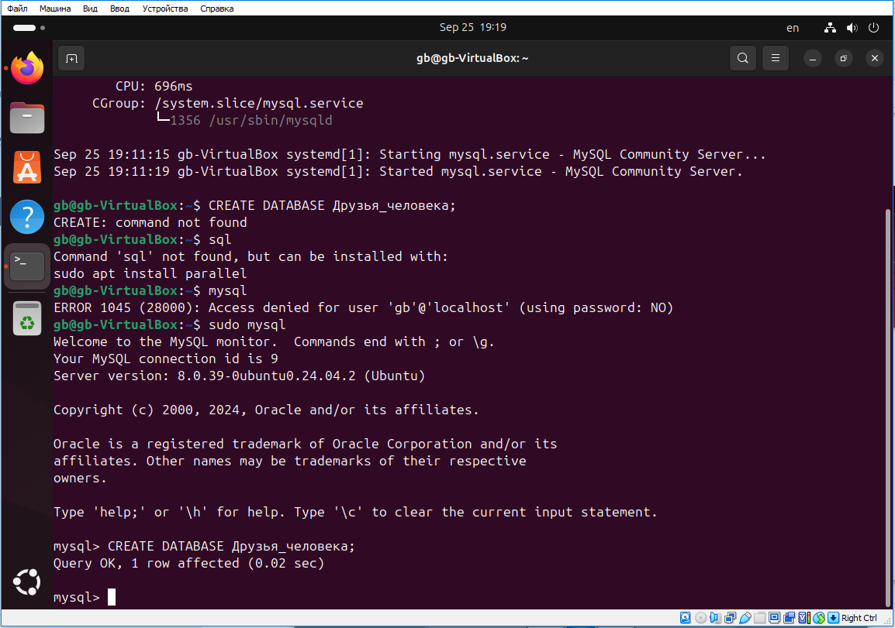

# Итоговая контрольная работа
# по курсу специализации


**Информация о проекте**
* Необходимо организовать систему учета для питомника в котором живут домашние и вьючные животные.

**Как сдавать проект**

Для сдачи проекта необходимо создать отдельный общедоступный
репозиторий (Github, gitlub, или Bitbucket). Разработку вести в этом репозитории, использовать пул реквесты на изменения. 
Программа должна запускаться и работать, ошибок при выполнении программы быть не должно.
Программа, может использоваться в различных системах, поэтому необходимо разработать класс в виде конструктора.


### Задание

1. Используя команду cat в терминале операционной системы Linux, создать
два файла Домашние животные (заполнив файл собаками, кошками,
хомяками) и Вьючные животными заполнив файл Лошадьми, верблюдами и
ослы), а затем объединить их. Просмотреть содержимое созданного файла.
Переименовать файл, дав ему новое имя (Друзья человека).
2. Создать директорию, переместить файл туда.
3. Подключить дополнительный репозиторий MySQL. Установить любой пакет
из этого репозитория.
4. Установить и удалить deb-пакет с помощью dpkg.
5. Выложить историю команд в терминале ubuntu
6. Нарисовать диаграмму, в которой есть класс родительский класс, домашние
животные и вьючные животные, в составы которых в случае домашних
животных войдут классы: собаки, кошки, хомяки, а в класс вьючные животные
войдут: Лошади, верблюды и ослы).
7. В подключенном MySQL репозитории создать базу данных “Друзья
человека”
8. Создать таблицы с иерархией из диаграммы в БД
9. Заполнить низкоуровневые таблицы именами(животных), командами
которые они выполняют и датами рождения
10. Удалив из таблицы верблюдов, т.к. верблюдов решили перевезти в другой
питомник на зимовку. Объединить таблицы лошади, и ослы в одну таблицу.
11.Создать новую таблицу “молодые животные” в которую попадут все
животные старше 1 года, но младше 3 лет и в отдельном столбце с точностью
до месяца подсчитать возраст животных в новой таблице
12. Объединить все таблицы в одну, при этом сохраняя поля, указывающие на
прошлую принадлежность к старым таблицам.
13.Создать класс с Инкапсуляцией методов и наследованием по диаграмме.
14. Написать программу, имитирующую работу реестра домашних животных.
В программе должен быть реализован следующий функционал:
14.1 Завести новое животное
14.2 определять животное в правильный класс
14.3 увидеть список команд, которое выполняет животное
14.4 обучить животное новым командам
14.5 Реализовать навигацию по меню
15.Создайте класс Счетчик, у которого есть метод add(), увеличивающий̆
значение внутренней̆int переменной̆на 1 при нажатие “Завести новое
животное” Сделайте так, чтобы с объектом такого типа можно было работать в
блоке try-with-resources. Нужно бросить исключение, если работа с объектом
типа счетчик была не в ресурсном try и/или ресурс остался открыт. Значение
считать в ресурсе try, если при заведения животного заполнены все поля.

### Решение

1. Команды Bash:
```bash
cat > "Домашние животные"
Собаки
Кошки
Хомяки

'Ctrl+d'
```

```bash
cat > "Вьючные животные"
Лошади
Верблюды
Ослы

'Ctrl+d'
```

```bash
cat "Домашние животные" "Вьючные животные" > Animals
cat Animals
mv "Animals" "Друзья человека"
```


2. Команды Bash:

```bash
mkdir folder_attestation
mv 'Друзья человека' folder_attestation/
ls
cd folder_attestation/
ls
```


3. Команды Bash:

```bash
sudo apt-get update
sudo apt update
sudo apt install mysql-server
sudo service mysql status
```



4. Команды Bash:

```bash
wget https://ubuntu.pkgs.org/22.04/ubuntu-universe-arm64/cowsay_3.03+dfsg2-8_all.deb
sudo dpkg -i cowsay_3.03+dfsg2-8_all.deb
sudo dpkg -r cowsay
```


5. Команды Bash:

```bash
history
```


6. Диаграмма классов:


7. Код sql:

```sql
CREATE DATABASE Друзья человека;
```


8. Код sql:

```sql

USE Друзья_человека;

CREATE TABLE Commands
(
    id INT PRIMARY KEY NOT NULL AUTO_INCREMENT,
    name varchar(30),
    description varchar(255)
);


CREATE TABLE Animal_Group
(
    id INT PRIMARY KEY NOT NULL AUTO_INCREMENT,
    name varchar(30)
);

CREATE TABLE Animal_Type
(
    id INT PRIMARY KEY NOT NULL AUTO_INCREMENT,
    name varchar(30),
    group_id INT,
    FOREIGN KEY (group_id) REFERENCES Animal_Group (id)
    ON DELETE CASCADE ON UPDATE CASCADE
);

CREATE TABLE Cart_Animal
(
    id INT PRIMARY KEY NOT NULL AUTO_INCREMENT,
    name varchar(30),
    birthDay DATE,
    genius_id INT,
    FOREIGN KEY (genius_id) REFERENCES Animal_Type (id)
    ON DELETE CASCADE ON UPDATE CASCADE
);

CREATE TABLE Animal_Command
(
    animal_id INT NOT NULL,
    command_id INT NOT NULL,

    PRIMARY KEY (animal_id, command_id),
    FOREIGN KEY (animal_id) REFERENCES Cart_Animal (id)
    ON DELETE CASCADE ON UPDATE CASCADE,
    FOREIGN KEY (command_id) REFERENCES Commands (id)
    ON DELETE CASCADE  ON UPDATE CASCADE
);

show databases;
show tables;
```


9. Код sql:

```sql

INSERT INTO Commands(name)
VALUES
 ('Фас!'),
 ('Бегать'),
 ('Галоп!'),
 ('Поклон!'),
 ('Лежать!');

INSERT INTO Animal_Group (name)
VALUES
 ('Вьючные животные'),
 ('Домашние животные');

INSERT INTO Animal_Type (name, group_id)
VALUES
 ('Лошадь', 1),
 ('Верблюд', 1),
 ('Осел', 1),
 ('Кошка', 2),
 ('Собака', 2),
 ('Хомяк', 2);

INSERT INTO Cart_Animal (name, birthDate, genius_id)
VALUES
 ('Туман', '2021-08-17', 1),
 ('Рыжий', '2023-03-03', 1),
 ('Сахара', '2018-07-20', 2),
 ('Тормоз', '2019-01-01', 3),
 ('Перс', '2016-07-07', 4),
 ('Мухтар', '2022-09-07', 5),
 ('Хомо', '2023-12-19', 6);


INSERT INTO Animal_Command (animal_id, command_id)
VALUES
 (1, 3), (2, 4), (3, 5),
 (4, 5), (5, 2), (6, 1),
 (7, 2);
```
10. Код sql:
```sql
DELETE FROM Cart_Animal WHERE genius_id = 2;

CREATE TABLE Horse_Donkey AS
SELECT * from Cart_Animal WHERE genius_id = 1
UNION
SELECT * from Cart_Animal WHERE genius_id = 3;
```

11. Код sql:

```sql
CREATE TABLE Young_Animals AS
SELECT id, name, birthDay, datediff(curdate(),birthDay) DIV 31 as age, genius_id 
from Cart_Animal 
WHERE date_add(birthDay, INTERVAL 1 YEAR) < curdate() 
AND date_add(birthDay, INTERVAL 3 YEAR) > curdate();
```

12. Код Sql:

```sql
SELECT id, name, birthDay, genius_id FROM Horse_Donkey
UNION
SELECT id, name, birthDay, genius_id FROM Young_Animals;
```
